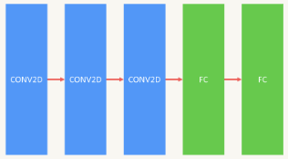

# ConnectsLab Speech

2023년 11월 9일 ~ 2023년 12월 15일 (37일간) 까지 이어드림스쿨에서 진행된 기업연계 프로젝트입니다.

Speech-To-Text 및 Audio Gender Classification 기술을 이용합니다.

## 😆 Members

기업프로젝트에 참가한 멤버입니다.

😆 [김민주](https://github.com/donaldducks) 😆 [박민수](https://github.com/pingu605) 😆 [이선민](https://github.com/GoX2Maker) 😆 [조인철](https://github.com/carryplz)
😆 [최희영](https://github.com/MrSteveChoi)

## 📂 Git 파일 구조

```
.
├── DeepSpeech2
│   ├── configs
│   │   ├── evalConfigs.yaml
│   │   ├── trainConfigs.yaml
│   │   └── transcribeConfigs.yaml
│   ├── deepspeech_pytorch
│   │   ├── decoder.py
│   │   ├── inference.py
│   │   ├── loader
│   │   │   ├── data_loader.py
│   │   │   ├── merge_manifests.py
│   │   │   ├── sparse_image_warp.py
│   │   │   └── spec_augment.py
│   │   ├── logger.py
│   │   ├── model.py
│   │   ├── state.py
│   │   ├── testing.py
│   │   └── utils.py
│   ├── eval.py
│   ├── preprocessing
│   │   ├── 01_jsontocsv.ipynb
│   │   └── 02_prepareDataset.ipynb
│   ├── train.py
│   └── transcribe.py
|   └── README.md
├── classification
│   ├── configs
│   │   ├── evalConfigs.yaml
│   │   ├── trainConfigs.yaml
│   │   └── transcribeConfigs.yaml
│   ├── eval.py
│   ├── parts
│   │   ├── loader.py
│   │   └── model.py
│   ├── preprocessing
│   │   ├── 01_jsontocsv.ipynb
│   │   └── 02_prepareDataset.ipynb
│   ├── train.py
│   └── transcribe.py
│   └── README.md
├── LICENSE
└── README.md
└── requirements.txt

10 directories, 31 files
```

## Wiki

프로젝트를 진행하면서 참고한 논문 및 자료를 Wiki에 정리했습니다.

👉🏻 [위키 바로가기](https://github.com/GoX2Maker/ConnectsLab_Speech/wiki)

# 1. 컴퓨터 환경 🖥️

이어드림 스쿨에서 지원받은 서버.

```
- GPU : T4 x 2
- RAM : 32GB
```

추가적인 개인 자원

```
- GPU : T4, 4090
- RAM : 64GB
```

# 2. 데이터셋(Data set)

## 2.1. 자유대화 음성

</img>

👉🏻 [자유대화 음성 바로가기](https://aihub.or.kr/aihubdata/data/view.do?currMenu=115&topMenu=100&aihubDataSe=realm&dataSetSn=109)

AI-Hub의 "한국어 자유대화 음성" 데이터로 학습을 했습니다. 지원받은 컴퓨터 자원을 고려해서 데이터를 선별했습니다.
해당 데이터로 STT 및 Classfication 데이터 셋으로 활용했습니다.

선별 기준은 다음과 같습니다.

- 남녀 : 5:5
- 나이대 : 아이를 키울 확률이 높다고 판단되는 20살 ~ 40살로 설정
- 음성 훈련데이터 시간 : 200시간, 1,000시간 (컴퓨팅 자원 고려)
- 음성 평가데이터 시간 : 20시간

## 2.2. 소음데이터

</img>

👉🏻 [소음데이터 바로가기](https://www.aihub.or.kr/aihubdata/data/view.do?currMenu=115&topMenu=100&aihubDataSe=data&dataSetSn=71405)

소음이 있는 환경에서의 STT 결과를 확인하기 위해 소음데이터를 활용하였습니다.

- 녹음 환경 : 가정에서의 소음환경 (청소기 소음, 세탁기 소음 등)
- 음성 데이터 시간 : 50시간

# 3. STT(Speech-To-Text)

STT로 Deepspeech2와 Whisper를 이용했습니다.

처음 다뤄보는 STT model이기 때문에 E2E-ASR의 기초 개념부터 다뤄볼 수 있는 모델인 Deepspeech2를 선정하였습니다.

이후 edge device에서도 활용 가능한 가벼운 오픈소스 모델인 Whisper-tiny를 파인튜닝 후 한국어 자유대화 음성 데이터셋을 기반으로 scratch training된 DeepSpeech2 모델과의 성능비교를 했습니다.

## 3.1. Whisper

### 3.1.1. Whisper Fine-turing

오픈 소스이며, 다양한 언어에 대해서 제로샷 성능이 좋고 최근에 영상 자동자막 task에서 널리 쓰이는 모델이기 때문에 Whisper를 기준 모델로 선정하였습니다.
또한 edge-device에서의 활용을 고려하여 가장 가벼운 모델인 Whisper-tiny를 비교군으로 설정하였습니다.

|     구분      |           파라미터           | 노이즈 제거유무 | 일반 음성 CER | 원거리 소음 CER | 근거리 소음 CER |                 비고                 |
| :-----------: | :--------------------------: | :-------------: | :-----------: | :-------------: | :-------------: | :----------------------------------: |
| whisper-tiny  |              X               |        X        |    29.71%     |     72.73%      |     76.03%      |              일반 모델               |
| fine-tuning 1 | max_steps 1000 batch_size 32 |        X        |    32.90%     |     91.45%      |     85.62%      |              학습 실험               |
| fine-tuning 2 | max_stpes 4500 batch_size 32 |        X        |    19.53%     |     123.78%     |     109.89%     |                1epoch                |
| fine-tuning 3 | max_stpes 4500 batch_size 64 |        X        |    31.40%     |     118.56%     |     112.37%     |                2epoch                |
| fine-tuning 4 | max_stpes 4500 batch_size 32 |        O        |       X       |     189.64%     |     153.44%     | 1epoch 모델 + noisereduce 라이브러리 |

## 3.2. DeepSpeech2

기존의 DeepSpeech2가 사용하던 CTCLoss library가 지원 종료되어 이를 pytorch.nn.CTCLoss로 수정했습니다.<br>
한국어 STT하면서 여러 에러 발생했는데 이를 수정했습니다.

### 3.2.1. 한국어 DeepSpeech2 사용방법

DeepSpeech2 사용하는 방법은 [README.md](https://github.com/GoX2Maker/ConnectsLab_Speech/blob/main/DeepSpeech2/README.md)에 작성했습니다.

### 3.2.2. Train 결과

컴퓨터 자원에 따라 학습데이터를 다르게 했습니다.<br>
(200시간 데이터를 T4로 돌렸을 때 1epoch에 3시간 정도 소요되었습니다.)

|       구분       | 노이즈 제거유무 | 일반 음성 CER | 원거리 소음 CER | 근거리 소음 CER |         비고          |
| :--------------: | :-------------: | :-----------: | :-------------: | :-------------: | :-------------------: |
|  200시간 데이터  |        X        |      16%      |       62%       |       53%       | 5 epoch (best model)  |
| 1,000시간 데이터 |        X        |      10%      |       56%       |       47%       | 11 epoch (best model) |

### 3.2.3. DeepSpeech2 VS Whisper-tiny

scratch training된 DeepSpeech2 모델이 Whisper-tiny 파인튜닝보다 좋은 결과가 나왔습니다.

|          구분           | 노이즈 제거유무 | 일반 음성 CER | 원거리 소음 CER | 근거리 소음 CER |
| :---------------------: | :-------------: | :-----------: | :-------------: | :-------------: |
|    DEEP Speech2 Best    |        X        |    10.23%     |     56.59%      |     47.11%      |
| whisper-finetuning Best |        X        |    19.53%     |     123.78%     |     109.89%     |
|      whisper-tiny       |        X        |    29.71%     |     72.73%      |     76.03%      |

### 3.2.4. DeepSpeech2 허깅페이스

</img>

아래의 허깅페이스 링크를 통해 DeepSpeech2 모델을 확인하실 수 있습니다.

👉🏻 [허깅페이스 바로가기](https://huggingface.co/spaces/GOx2Maker/DeepSpeech2_Kor)

## 3.3. 참고자료

- [Awesome-Korean-Speech-Recognition](https://github.com/rtzr/Awesome-Korean-Speech-Recognition)
  - 한국어 음성데이터로 학습된 STT API들간의 성능비교표 참고.
- [DeepSpeech2 Kor](https://github.com/fd873630/deep_speech_2_korean)
  - DeepSpeech2 한국어 코드를 참고했습니다.
- [DeepSpeech2](https://github.com/SeanNaren/deepspeech.pytorch)
  - DeepSpeech2 코드 참고했습니다.
- [Whisper-fine-tuning](https://colab.research.google.com/github/huggingface/community-events/blob/main/whisper-fine-tuning-event/fine_tune_whisper_streaming_colab.ipynb)
  - Whisper fine tuning을 할 때 참고했습니다.
- [Whisper 한국어 파인듀닝 논문](https://www.eksss.org/archive/view_article?pid=pss-15-3-75)
  - Whisper 한국어 파인듀닝 논문자료입니다.

# 4. Classification

부모간의 발화비율을 확인하기 위해 음성데이터 상태에서 발화자의 성별을 분류하는 Gender Classification model을 만들었습니다.

## 4.1. 모델구조

제작한 모델 구조는 다음과 같습니다.

</img>

## 4.2. 음성 분류 사용방법

음성 분류 사용하는 방법은 [README.md](https://github.com/GoX2Maker/ConnectsLab_Speech/blob/main/classification/README.md)에 작성했습니다.

## 4.3. 음성 분류 허깅페이스

</img>

성별 분류 결과 Test Set에서 0.98(acc)를 달성하였습니다.
해당 모델은 아래의 허깅페이스 링크를 통해 확인해보실 수 있습니다.

👉🏻 [허깅페이스 바로가기](https://huggingface.co/spaces/GOx2Maker/audio_gender_classifier)
